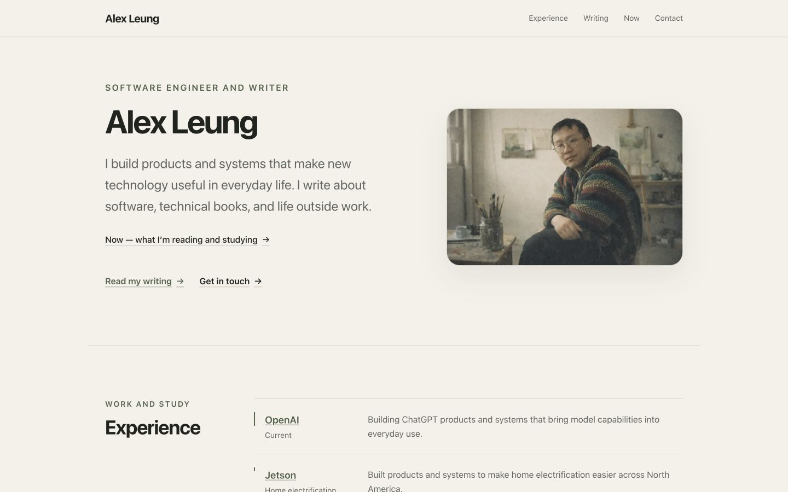

# alexleung.ca

Personal website and writing hub for Alex Leung. Built with Next.js 16, React 19, TypeScript, and Tailwind CSS.



## Installation & Setup

1. Clone the repo.
2. Use the correct Node.js version:

   ```bash
   nvm use
   ```

3. Enable Corepack and install the pinned Yarn version:

   ```bash
   corepack enable
   corepack install
   ```

4. Install dependencies:

   ```bash
   yarn install
   ```

5. Configure the repository Git hooks:

   ```bash
   yarn prepare
   ```

6. Start the development server:

   ```bash
   yarn dev
   ```

   App runs at `http://localhost:3000`.

## Development Commands

- `yarn dev` — start development server
- `yarn prepare` — configure repo Git hooks path (`.githooks`)
- `yarn image:variants` — generate image variants and refresh image variant manifest
- `yarn image:variants:stage` — generate and stage variants for staged post/image changes
- `yarn build` — generate image variants and build the static export (`out/`) with analytics disabled by default
- `yarn build:prod` — build static export (`out/`) with analytics enabled for a production deploy
- `yarn lint` — run ESLint, Prettier, and Knip checks
- `yarn lint:unused` — run the pinned Knip unused-code check
- `yarn lint:fix` — auto-fix lint/format issues
- `yarn test` — run Jest tests
- `yarn test:e2e` — run Playwright smoke tests in Docker against the exported site
- `yarn test:e2e:host` — run Playwright smoke tests directly on the host when Docker is unavailable
- `yarn test:e2e:visual` — run Playwright visual regression tests in Docker
- `yarn test:e2e:visual:host` — run Playwright visual regression tests directly on the host when Docker is unavailable
- `yarn test:e2e:visual:update` — regenerate Playwright visual snapshots in Docker
- `yarn test:e2e:visual:update:host` — regenerate Playwright visual snapshots directly on the host when Docker is unavailable
- `yarn typecheck` — run TypeScript check (`tsc --noEmit`)
- `yarn test:watch` — run tests in watch mode
- `yarn test:coverage` — run tests with coverage
- `yarn perf:lighthouse` — run Lighthouse CI against static export (`out/`)
- `yarn deploy` — build and deploy `out/` to GitHub Pages

> This project targets static export deployment, so there is no runtime Next.js production server command.

Google Analytics is gated behind `NEXT_PUBLIC_ENABLE_ANALYTICS=true`, so analytics stays off for ordinary `yarn build`, CI verification builds, and Lighthouse runs unless a production deploy explicitly opts in. Both the GitHub Actions deploy workflow and the manual `yarn deploy` flow enable analytics via `yarn build:prod`. Playwright does not rely on this flag because its shared fixture aborts requests to Google Tag Manager and Google Analytics even when tests target the live site.

## End-to-End Testing

Playwright targets the static export rather than `yarn dev`. Use Docker commands by default, and use the host-mode wrappers when Docker is unavailable.

```bash
yarn test:e2e
yarn test:e2e:visual
PLAYWRIGHT_BASE_URL=https://alexleung.ca yarn test:e2e
```

See [`docs/playwright-testing-design.md`](./docs/playwright-testing-design.md) for the current browser matrix, host-mode wrappers, visual snapshot workflow, and CI behavior.

## Codespaces: Lighthouse Setup

Codespaces may need extra Chrome runtime setup before `yarn perf:lighthouse` can run. See [`docs/codespaces.md`](./docs/codespaces.md) for the current one-time setup and troubleshooting notes.

## Image Variant Automation

- Variant generator script:
  - `scripts/generate-image-variants.mjs`
- Generated output:
  - responsive cover variants: `*-card-sm.webp`, `*-card-md.webp`, `*-card.webp`, `*-hero-sm.webp`, `*-hero.webp`
  - responsive inline markdown image variants: `*-content-sm.webp`, `*-content.webp`
  - responsive variants for the homepage portrait
  - manifest: `src/generated/imageVariantManifest.json` (profiles + variant paths + dimensions)
- Build integration:
  - `yarn build` runs `yarn image:variants` before creating the static export
- Commit integration:
  - `.githooks/pre-commit` runs `yarn image:variants:stage` to keep variants in sync with staged changes
- Runtime usage:
  - `src/components/BlogPostCard.tsx` and `src/app/blog/[slug]/page.tsx` read cover profiles from the manifest
  - `src/lib/markdownToHtml.ts` reads inline image profiles from the manifest

### Adding Images (Human Workflow)

1. Add the source image under `public/assets/...`.
2. If it is a blog post cover, set `coverImage` in that post frontmatter.
3. If it is an inline blog image, reference it in markdown using a normal image link.
4. Run `yarn image:variants` (or rely on pre-commit: `yarn image:variants:stage`).
5. Commit both the source image and generated outputs:
   - variant files under `public/assets/...`
   - `src/generated/imageVariantManifest.json`

If `profiles.cover` or `profiles.inlineContent` is missing in the manifest, runtime now fails fast by design.

## Architecture Snapshot

- **Framework**: Next.js App Router + React + TypeScript
- **Styling**: Tailwind CSS
- **Deployment**: static export (`output: 'export'`) for GitHub Pages
- **SEO**: centralized metadata + JSON-LD helpers in `src/lib/seo`
- **Content**: Markdown posts parsed and validated at build time

### URL Convention

- Site routes use trailing slashes to match `trailingSlash: true` and the GitHub Pages static export shape.
- Prefer `/`, `/now/`, and `/blog/post-slug/` over slashless internal links.
- Keep internal links, canonical URLs, sitemap entries, and tests aligned with that convention.
- Do not add trailing slashes to file-like endpoints or assets such as `/feed.xml`, `/robots.txt`, `/sitemap.xml`, or `/assets/...`.

### High-level Structure

```bash
src/
├── app/         # Route entrypoints and route-scoped components
├── components/  # Shared UI components
├── constants/   # Static content/config constants
└── lib/         # Blog/content loading + SEO + markdown pipeline
```

## Documentation Map

- [`docs/README.md`](./docs/README.md) — docs directory guide and document inventory
- [`docs/architecture-seo-status.md`](./docs/architecture-seo-status.md) — architecture and SEO status snapshot
- [`docs/blog-notification-report.md`](./docs/blog-notification-report.md) — RSS and follow.it notification runbook
- [`docs/codespaces.md`](./docs/codespaces.md) — Codespaces Lighthouse troubleshooting
- [`docs/design-system.md`](./docs/design-system.md) — current visual, responsive, interaction, and accessibility rules
- [`docs/playwright-testing-design.md`](./docs/playwright-testing-design.md) — Playwright smoke, visual, host-mode, and CI workflow
- [`docs/typography-audit.md`](./docs/typography-audit.md) — decision record for explicit prose sizing

## Licensing

Split-license model:

- Code and configuration: [MIT License](./LICENSE)
- Content and media assets: [CC BY-NC 4.0](./LICENSE-CONTENT)

If a file contains a different license notice, that notice takes precedence.
